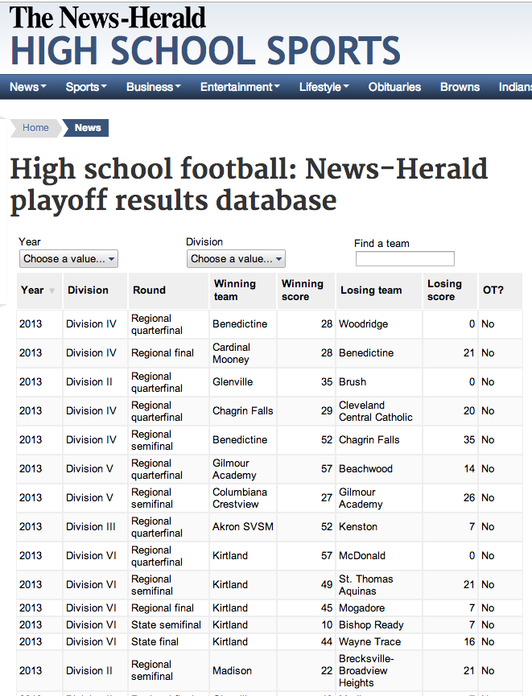

ohio-fb-table
=============

What is this?
-------------

Table of outcomes of preps high school state playoff games in Ohio. This ran in April, 2014.

Live demo: http://www.news-herald.com/sports/20140427/high-school-football-news-herald-playoff-results-database

Credits
---------

Vaughn Hagerty, Howard Primer

Assumptions
-----------

* Google visualization API

What's in here?
---------------

The project contains the following folders and important files:

* ``index.html`` -- The app html
* ``lib/js`` -- Javascript
* ``lib/css`` -- Strangely enough, stylesheets

License
----------

This code is available under the MIT license. For more information, please see the LICENSE file in this repo.
